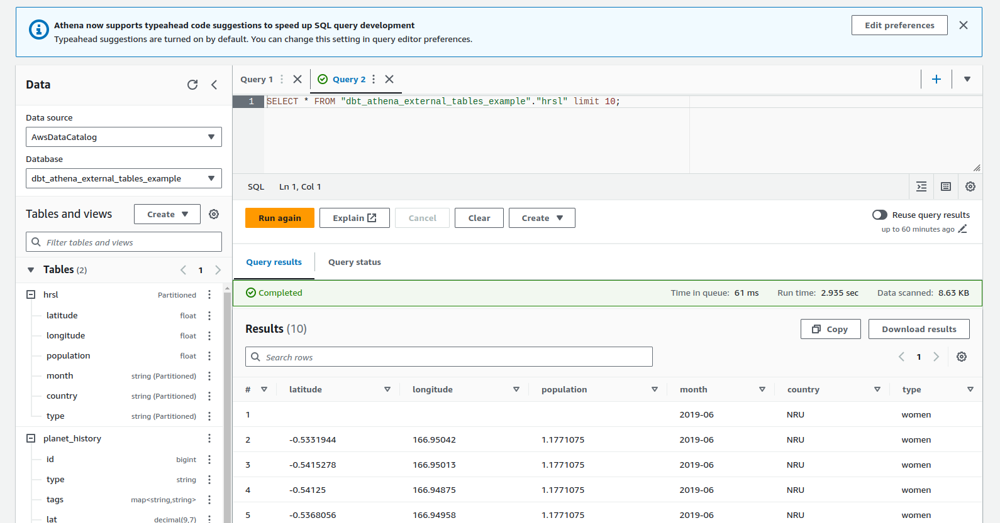

# Usage

```bash
python -m venv venv
. venv/bin/activate
pip install -U pip
pip install -U -r requirements.txt

dbt debug
dbt deps
dbt run-operation stage_external_sources --vars "ext_full_refresh: true" --target athena
```

# Example

```terminal
(venv) @brabster ➜ /workspaces/dbt-athena-external-tables/example_project (main) $ dbt run-operation stage_external_sources --vars "ext_full_refresh: true" --target athena
22:14:07  Running with dbt=1.7.13
22:14:08  Registered adapter: athena=1.7.2
22:14:08  Found 2 sources, 0 exposures, 0 metrics, 478 macros, 0 groups, 0 semantic models
22:14:08  1 of 2 START external source dbt_athena_external_tables_example.hrsl
22:14:08  1 of 2 (1) drop table if exists `AwsDataCatalog`.`dbt_athena_external_tables_example`.`hrsl...  
22:14:10  1 of 2 (1) OK -1
22:14:10  1 of 2 (2) create external table `AwsDataCatalog`.`dbt_athena_external_tables_example`.`hrs...  
22:14:11  1 of 2 (2) OK -1
22:14:11  1 of 2 (3) msck repair table `AwsDataCatalog`.`dbt_athena_external_tables_example`.`hrsl`
22:14:28  1 of 2 (3) OK -1
22:14:28  2 of 2 START external source dbt_athena_external_tables_example.planet_history
22:14:28  2 of 2 (1) drop table if exists `AwsDataCatalog`.`dbt_athena_external_tables_example`.`plan...  
22:14:29  2 of 2 (1) OK -1
22:14:29  2 of 2 (2) create external table `AwsDataCatalog`.`dbt_athena_external_tables_example`.`pla...  
22:14:31  2 of 2 (2) OK -1
```


